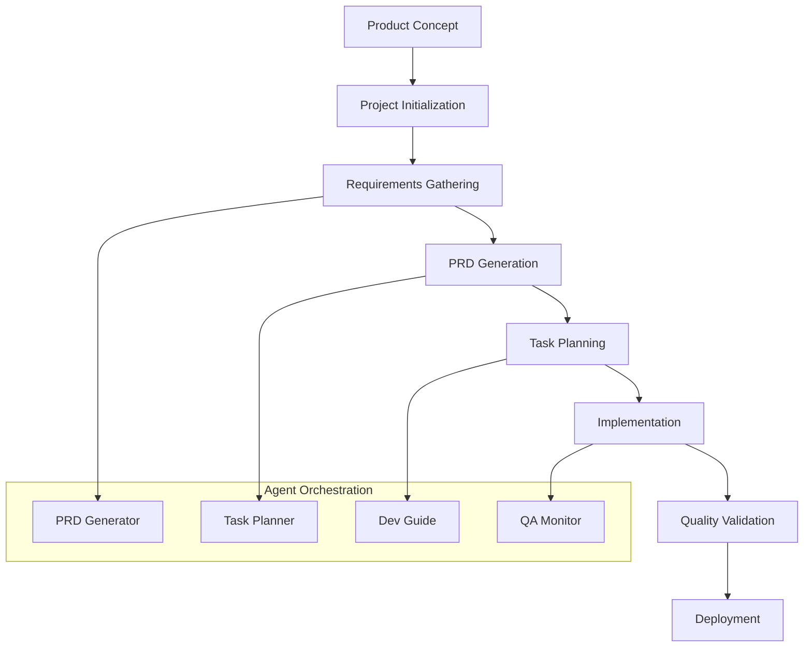

# RULEMAP-PRD Workflow Guide
## End-to-End Process for AI-Driven Product Development

### Version 1.0 | Complete Implementation Guide

---

## Workflow Overview

The RULEMAP-PRD system provides a complete, AI-guided workflow from initial product concept to deployment-ready features. This guide walks you through each phase with detailed steps, agent interactions, and quality checkpoints.



---

## Phase 1: Project Initialization

### Step 1.1: Create Project Structure
```bash
# Initialize new RULEMAP-PRD project
python automation/project-init-script.py "Your-Project-Name" --type="web-app" --path="./projects"
```

**Expected Output**:
- Complete folder structure created
- Project charter template generated
- Agent configurations initialized
- README with quick start guide

### Step 1.2: Complete Project Charter
**Location**: `00-project-setup/project-charter.md`

**Required Actions**:
1. Define stakeholders and their roles
2. Clarify business objectives and success metrics
3. Identify technical constraints and requirements
4. Set timeline expectations and milestones

**Quality Gate**: Charter reviewed and approved by key stakeholders

### Step 1.3: Configure Project Settings
**Location**: `00-project-setup/project-config.yaml`

**Key Configuration Areas**:
- RULEMAP scoring thresholds
- Agent activation settings
- Automation preferences
- Integration endpoints

---

## Phase 2: Requirements Gathering & PRD Generation

### Step 2.1: Activate PRD Generator Agent
```bash
# Activate PRD Generator with project context
rulemap-agent activate prd-generator --project="Your-Project-Name" --config="templates/agent-configs/prd-generator-agent.yaml"
```

### Step 2.2: Conduct RULEMAP-Guided Requirements Gathering
**Agent Process**:
1. **Initial Concept Analysis**: Agent reviews project charter and initial concept
2. **Stakeholder Interviews**: Structured interviews using RULEMAP framework
3. **Requirements Elicitation**: Systematic gathering using 7-element structure

**Example Agent Interaction**:
```
PRD Agent: I'll help you create a comprehensive PRD using the RULEMAP framework. Let's start with ROLE - who is the primary stakeholder for this feature and what authority do they have in decision-making?

User: [Provides stakeholder information]

PRD Agent: Excellent. Now for UNDERSTANDING - what specific problem does this feature solve for your users? Can you describe the current pain points?

[Continues through all RULEMAP elements...]
```

### Step 2.3: PRD Generation and Refinement
**Agent Workflow**:
1. **Draft Generation**: Agent creates initial PRD using RULEMAP template
2. **Self-Scoring**: Agent evaluates draft against RULEMAP rubrics
3. **Iterative Refinement**: Agent improves draft until target score achieved
4. **Stakeholder Review**: Collaborative refinement with stakeholder input

**Output Location**: `01-requirements/prd-[feature-name].md`

**Quality Gates**:
- RULEMAP score >= 8.0
- All required sections complete with detailed content
- Stakeholder approval obtained
- Technical feasibility confirmed

### Step 2.4: Session Documentation
**Agent automatically creates**:
- Session summary in `04-agents/session-summaries/YYYY-MM-DD-session-01.md`
- Updated agent assignments in `04-agents/agent-assignments.md`
- Performance metrics in `04-agents/agent-performance/`

---

## Phase 3: Task Planning & Breakdown

### Step 3.1: Automatic Handoff to Task Planner
**Trigger**: PRD achieves RULEMAP score >= 8.0 and receives stakeholder approval

**Agent Transition**:
```yaml
HANDOFF_PROCESS:
  from_agent: "prd-generator-v1"
  to_agent: "task-planner-v1"
  trigger: "PRD validation complete"
  handoff_package:
    - "Complete PRD with RULEMAP score"
    - "Stakeholder feedback summary"  
    - "Technical constraint analysis"
    - "Business priority ranking"
```

### Step 3.2: Codebase Analysis and Task Generation
**Task Planner Agent Process**:
1. **PRD Analysis**: Parse all requirements and acceptance criteria
2. **Codebase Assessment**: Analyze existing architecture and reusable components
3. **Task Breakdown**: Create hierarchical task structure
4. **Dependency Mapping**: Identify prerequisites and integration points
5. **Effort Estimation**: Apply team velocity data to estimate effort

**Agent Interaction Example**:
```
Task Planner: I've analyzed your PRD and current codebase. I'll break this into 5 main phases with detailed subtasks. Let me start with the high-level breakdown:

1. Database Schema & API Foundation (Week 1-2)
2. Core Business Logic Implementation (Week 2-3)  
3. User Interface Development (Week 3-4)
4. Integration & Testing (Week 4-5)
5. Deployment & Monitoring Setup (Week 5)

Would you like me to proceed with detailed subtask breakdown?

User: Go

Task Planner: Excellent. I'll now generate the detailed subtasks...
```

### Step 3.3: Task List Generation
**Output Location**: `03-implementation/tasks-prd-[feature-name].md`

**Task List Structure**:
```markdown
## Relevant Files
- `src/components/NewFeature.tsx` - Main component
- `src/api/feature-api.ts` - API integration
- `src/types/feature-types.ts` - Type definitions

## Tasks
- [ ] 1.0 Database Schema & API Foundation  
  - [ ] 1.1 Design database tables for feature data
  - [ ] 1.2 Create API endpoints for CRUD operations
  - [ ] 1.3 Implement data validation middleware
- [ ] 2.0 Core Business Logic Implementation
  - [ ] 2.1 Implement feature calculation algorithms
  - [ ] 2.2 Add business rule validation
  - [ ] 2.3 Create error handling and logging
```

**Quality Gates**:
- 100% PRD requirements mapped to tasks
- All dependencies identified and sequenced
- Effort estimates provided for all tasks
- Development team review completed

---

## Phase 4: Implementation Guidance

### Step 4.1: Development Guide Agent Activation
**Trigger**: Task breakdown approved and development resources allocated

**Agent Responsibilities**:
- Guide developers through task implementation
- Provide code reviews and quality feedback
- Manage testing and validation processes
- Track progress and update stakeholders

### Step 4.2: Task-by-Task Implementation
**Implementation Process**:
1. **Task Selection**: Agent guides developer to next priority task
2. **Implementation Support**: Provides coding assistance and best practices
3. **Code Review**: Validates implementation against acceptance criteria
4. **Testing Validation**: Ensures adequate test coverage
5. **Progress Update**: Marks tasks complete and updates tracking

**Example Agent Interaction**:
```
Dev Guide: Ready to start task 1.1 - "Design database tables for feature data". Based on the PRD requirements, I recommend the following table structure:

[Provides specific technical guidance]

Let me know when you've implemented this and I'll review it against the acceptance criteria.

Developer: [Completes implementation]

Dev Guide: Great work! I've reviewed your implementation and it meets all acceptance criteria. The foreign key relationships properly enforce data integrity. Let's mark this complete and move to task 1.2.
```

### Step 4.3: Continuous Quality Monitoring
**QA Agent Activities** (Running in parallel):
- Monitor code quality against RULEMAP standards
- Track requirement compliance
- Generate quality reports
- Flag potential issues early

**Progress Tracking**:
- Real-time task completion updates
- Development velocity monitoring  
- Blocker identification and resolution
- Milestone progress tracking

---

## Phase 5: Quality Validation & Deployment

### Step 5.1: Comprehensive Quality Assessment
**QA Agent Final Review**:
1. **Requirements Validation**: Verify all PRD requirements implemented
2. **RULEMAP Scoring**: Score all project artifacts
3. **Testing Validation**: Confirm comprehensive test coverage
4. **Performance Assessment**: Validate against performance criteria

**Quality Report Location**: `05-quality-assurance/validation-reports/final-assessment-[date].md`

### Step 5.2: Deployment Preparation
**Deployment Checklist** (auto-generated in `03-implementation/deployment-checklist.md`):
- [ ] All acceptance criteria validated
- [ ] Performance requirements met
- [ ] Security requirements satisfied
- [ ] Documentation complete and current
- [ ] Monitoring and alerting configured
- [ ] Rollback procedures documented

### Step 5.3: Go-Live Decision
**Final Quality Gate**:
- Overall RULEMAP score >= 8.0
- All critical acceptance criteria passed
- Stakeholder sign-off obtained
- Technical readiness confirmed

---

## Agent Session Management

### Session Planning and Execution

#### PRD Generator Sessions
**Typical Session Flow**:
1. **Pre-session**: Review previous work and prepare interview questions
2. **Requirements gathering** (60-90 minutes): Structured RULEMAP interview
3. **Documentation** (30-45 minutes): Create/update PRD sections
4. **Review and refinement** (15-30 minutes): Self-scoring and improvement
5. **Session close**: Document progress and plan next steps

**Session Output**:
- Updated PRD sections
- Stakeholder feedback capture
- Question/issue tracking
- Next session planning

#### Task Planner Sessions
**Typical Session Flow**:
1. **PRD analysis** (30-45 minutes): Deep dive into requirements
2. **Codebase assessment** (45-60 minutes): Architecture and component analysis
3. **Task breakdown** (60-90 minutes): Create hierarchical task structure  
4. **Validation and refinement** (30 minutes): Review with development team

**Session Output**:
- Complete task breakdown
- Effort estimates and dependencies
- Implementation roadmap
- Resource requirements

#### Development Guide Sessions
**Ongoing Session Pattern**:
1. **Daily check-ins** (15-30 minutes): Progress review and next task planning
2. **Implementation support** (As needed): Code review and guidance
3. **Weekly progress reviews** (30-45 minutes): Milestone assessment and planning
4. **Issue resolution** (As needed): Blocker removal and problem solving

**Session Output**:
- Task completion updates
- Code quality assessments  
- Progress reports
- Issue resolution documentation

### Session Documentation Standards

#### Required Elements for All Sessions
1. **Objective clarity**: What the session aimed to accomplish
2. **Work completed**: Specific tasks and deliverables finished
3. **Decisions made**: Key choices with rationale
4. **Issues encountered**: Problems and their resolution status
5. **Next steps**: Clear priorities for following session
6. **Quality metrics**: RULEMAP scores and other quality indicators

#### Session Summary Template Usage
**Template Location**: `templates/project-structure/session-summary-template.md`

**Key Benefits**:
- Consistent documentation across all agents
- Easy handoff between sessions
- Progress tracking and accountability
- Historical project knowledge preservation
- Performance optimization insights

---

## Quality Assurance Integration

### Continuous RULEMAP Scoring
**Scoring Frequency**:
- **Draft artifacts**: After each significant update
- **Completed deliverables**: Before handoff to next phase  
- **Project milestones**: Comprehensive scoring at key checkpoints
- **Final validation**: Complete project assessment before deployment

### Quality Gates and Checkpoints
```yaml
QUALITY_GATES:
  prd_draft_complete:
    trigger: "Initial PRD sections filled"
    criteria: ["All RULEMAP elements present", "Basic scoring >= 6.0"]
    action: "Stakeholder review cycle"
    
  prd_ready_for_tasks:
    trigger: "Stakeholder approval received"  
    criteria: ["RULEMAP score >= 8.0", "Technical feasibility confirmed"]
    action: "Handoff to Task Planner Agent"
    
  tasks_ready_for_development:
    trigger: "Task breakdown complete"
    criteria: ["100% requirement coverage", "Estimates validated"]
    action: "Activate Development Guide Agent"
    
  implementation_complete:
    trigger: "All tasks marked finished"
    criteria: ["Acceptance criteria met", "Tests passing"]
    action: "Begin final quality validation"
    
  deployment_ready:
    trigger: "Quality validation passed"
    criteria: ["Performance targets met", "Security validated"]
    action: "Authorize deployment"
```

### Performance Optimization

#### Agent Performance Monitoring
**Tracked Metrics**:
- RULEMAP score achievement rates
- Session efficiency and duration
- Stakeholder satisfaction ratings
- Handoff success rates
- Issue resolution effectiveness

**Optimization Process**:
1. **Weekly performance review**: Analyze trends and identify improvements
2. **Monthly optimization**: Update agent configurations based on learnings
3. **Quarterly strategic review**: Assess overall system effectiveness
4. **Continuous learning**: Incorporate feedback into agent training

---

## Troubleshooting and Common Issues

### PRD Phase Issues
**Issue**: Stakeholders provide conflicting requirements
**Solution**: Document all perspectives, facilitate decision meeting, update PRD with agreed resolution

**Issue**: Technical constraints not identified early
**Solution**: Include technical review checkpoint in PRD process, engage technical stakeholders

**Issue**: RULEMAP score stuck below threshold
**Solution**: Use scoring rubrics to identify specific improvement areas, iterate on weakest elements

### Task Planning Issues  
**Issue**: Tasks too large or complex
**Solution**: Apply task sizing guidelines (max 5 days), break down further

**Issue**: Dependencies create bottlenecks
**Solution**: Look for parallelization opportunities, consider MVP scope reduction

**Issue**: Estimates consistently inaccurate
**Solution**: Calibrate against historical velocity, involve experienced developers in estimation

### Implementation Issues
**Issue**: Requirements clarification needed during development
**Solution**: Improve PRD quality gates, add developer review to requirements phase

**Issue**: Quality degrading under timeline pressure
**Solution**: Enforce quality gates, negotiate scope rather than compromise quality

**Issue**: Agent handoffs losing context
**Solution**: Improve session documentation, standardize handoff packages

---

## Success Metrics and KPIs

### Project-Level Metrics
- **Time to Market**: Concept to deployment timeline
- **Quality Score**: Final RULEMAP assessment
- **Stakeholder Satisfaction**: End-user and business stakeholder ratings
- **Resource Efficiency**: Actual vs. planned effort utilization

### Process-Level Metrics  
- **Requirements Stability**: Changes to PRD after approval
- **Planning Accuracy**: Task estimates vs. actual implementation time
- **Defect Rate**: Issues found in production vs. development
- **Agent Effectiveness**: Session success rates and handoff quality

### Continuous Improvement
**Monthly Reviews**: Assess metrics trends and identify improvement opportunities
**Quarterly Optimization**: Update processes and agent configurations
**Annual Strategic Assessment**: Evaluate overall system effectiveness and evolution

---

## Getting Started Checklist

### First-Time Setup
- [ ] Install RULEMAP-PRD system components
- [ ] Configure agent templates for your organization
- [ ] Set up project initialization automation
- [ ] Train team on workflow and processes
- [ ] Run pilot project to validate system

### For Each New Project
- [ ] Run project initialization script
- [ ] Complete project charter with stakeholders
- [ ] Configure project-specific settings
- [ ] Activate PRD Generator Agent  
- [ ] Follow workflow phases through deployment

### Ongoing Management
- [ ] Review agent performance weekly
- [ ] Update templates based on learnings
- [ ] Maintain quality standards and gates
- [ ] Optimize workflows for efficiency
- [ ] Scale successful patterns across projects

---

*Master the RULEMAP-PRD workflow to transform any product concept into a systematically-delivered, high-quality feature that meets both user needs and business objectives.*
