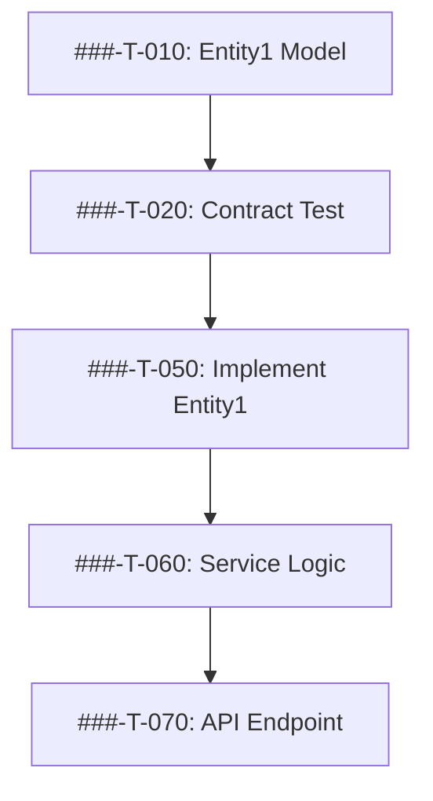

# Implementation Plan: [FEATURE NAME] (SpecMap Enhanced)

**Feature ID**: [###-feature-name]
**Plan ID**: [###-P]
**Branch**: `[###-feature-name]`
**Date**: [YYYY-MM-DD]
**Spec Link**: `01-specifications/features/[###-feature-name]/spec.md`
**RULEMAP Score Target**: 8.0+
**System**: SpecMap (Unified Spec-Kit + RULEMAP-PRD)

---

## Quick Reference

| Attribute | Value |
|-----------|-------|
| **Feature ID** | [###-F] |
| **Plan ID** | [###-P] |
| **Status** | [Draft/Review/Approved/Active] |
| **Agent** | Task Planning Agent v1 |
| **Planning Session** | [Session ID] |
| **Total Tasks** | [Estimated count] |
| **Total Decisions** | [Count] |
| **Dependencies** | [Count of external dependencies] |

---

## R - PLANNING ROLE & AUTHORITY

### Task Planning Agent Focus
**Primary Identity**: Brilliant recent graduate with advanced training in software architecture and project management
**Decision Authority**: Technical approach selection, task sequencing, effort estimation
**Authority Boundaries**: Can recommend architecture but requires approval for major decisions
**Collaboration Requirements**: Stakeholder validation on business priorities and timeline

### Planning Responsibility
**Mission**: Transform validated specification into actionable, sequenced implementation plan
**Accountability**: Ensure all requirements mapped to tasks, dependencies identified, feasible timeline
**Escalation Path**: Complex architectural decisions → Senior architect review

---

## U - PLANNING UNDERSTANDING & OBJECTIVES

### Planning Mission
**Primary Objective**: Generate comprehensive task breakdown with clear dependencies and realistic estimates
**Success Criteria**: Development team can begin implementation without clarification; all requirements covered
**Risk Mitigation**: Identify and document technical risks early; propose mitigation strategies

### Specification Analysis
**Source Document**: [Link to specification]
**RULEMAP Score**: [X.X/10]
**Requirements Count**: [Total functional requirements]
**Key User Stories**: [List 3-5 primary user stories]
**Acceptance Criteria Count**: [Total acceptance criteria]

### Business Context
**Strategic Alignment**: [How this feature supports business goals]
**User Impact**: [Expected user benefit]
**Timeline Pressure**: [Any urgency or deadline constraints]

---

## L - PLANNING LOGIC & APPROACH

### Planning Methodology
**Framework**: RULEMAP-structured task breakdown with Spec-Kit constitution compliance
**Sequencing Strategy**: Risk-first, dependency-aware prioritization with TDD approach
**Quality Integration**: Constitution compliance validation at each phase; RULEMAP scoring checkpoints

### Implementation Sequence Rationale
```yaml
PHASE_0_RESEARCH:
  purpose: "Validate technical assumptions and clarify unknowns"
  duration: "[X days]"
  critical_path: [Yes/No]

PHASE_1_FOUNDATION:
  purpose: "Establish core structure and dependencies"
  duration: "[X days]"
  critical_path: [Yes/No]

PHASE_2_CORE:
  purpose: "Implement primary functionality"
  duration: "[X days]"
  critical_path: [Yes/No]

PHASE_3_INTEGRATION:
  purpose: "Connect components and external systems"
  duration: "[X days]"
  critical_path: [Yes/No]

PHASE_4_VALIDATION:
  purpose: "Quality assurance and deployment preparation"
  duration: "[X days]"
  critical_path: [Yes/No]
```

---

## E - PLANNING ELEMENTS & SPECIFICATIONS

### Technical Context (Enhanced)

```yaml
TECHNOLOGY_STACK:
  language: "[Language/Version - e.g., Python 3.11]"
  framework: "[Framework - e.g., FastAPI]"
  database: "[Database - e.g., PostgreSQL 15]"
  testing: "[Test framework - e.g., pytest]"
  deployment: "[Platform - e.g., Docker/K8s]"

PERFORMANCE_TARGETS:
  response_time: "[e.g., <200ms p95]"
  throughput: "[e.g., 1000 req/s]"
  concurrent_users: "[e.g., 10k users]"
  data_volume: "[e.g., 1M records]"

CONSTRAINTS:
  platform: "[Target platform]"
  security: "[Compliance requirements]"
  accessibility: "[Accessibility standards]"
  integration: "[External systems]"
```

### Architecture Pattern
**Selected Pattern**: [e.g., "Layered architecture with MVC"]
**Rationale**: [Why this pattern was chosen]
**Alternatives Considered**: [Other options evaluated]
**Constitution Alignment**: [Which articles this satisfies]

---

## Constitution Check *(Spec-Kit Integration)*

### Pre-Planning Constitutional Analysis

#### Article I: Modularity Principle
- **Status**: [✓ Compliant / ⚠ Needs Justification / ✗ Violation]
- **Analysis**: [How plan ensures modularity]
- **Justification**: [If complexity needed]

#### Article II: Simplicity First
- **Status**: [✓ Compliant / ⚠ Needs Justification / ✗ Violation]
- **Analysis**: [How plan maintains simplicity]
- **Project Count**: [Number of projects/services]
- **Complexity Justification**: [If > 3 projects]

#### Article III: Test-First Development
- **Status**: [✓ Compliant / ⚠ Needs Justification / ✗ Violation]
- **Analysis**: [How TDD is enforced in task sequence]
- **Test Coverage Target**: [Percentage]

#### Article IV: Documentation Standards
- **Status**: [✓ Compliant / ⚠ Needs Justification / ✗ Violation]
- **Documentation Plan**: [What docs will be created]

#### Article V: Quality Gates
- **Status**: [✓ Compliant / ⚠ Needs Justification / ✗ Violation]
- **Gates Defined**: [List quality checkpoints]
- **RULEMAP Target**: [Score threshold]

#### Article VI: Stakeholder Alignment
- **Status**: [✓ Compliant / ⚠ Needs Justification / ✗ Violation]
- **Review Schedule**: [When stakeholders review]
- **Feedback Integration**: [How feedback incorporated]

### Complexity Tracking
*Fill ONLY if Constitution violations require justification*

```yaml
COMPLEXITY_ITEM_001:
  article: "[Article violated]"
  justification: "[Business/technical reason]"
  mitigation: "[How complexity is managed]"
  approval: "[Who approved this]"
```

---

## M - PLANNING MOOD & APPROACH

### Development Team Experience
**Target Feeling**: "Confident and empowered to implement without constant clarification"
**Communication Style**: Detailed explanations with clear rationale for all decisions
**Support Level**: Comprehensive documentation and context for every task

### Collaboration Approach
**With PRD Generator**: Validate understanding of all requirements; ask clarifying questions
**With Dev Guide**: Provide detailed context for implementation decisions
**With QA Monitor**: Define clear validation checkpoints and success criteria
**With Stakeholders**: Regular check-ins for priority validation and scope confirmation

---

## A - PLANNING AUDIENCE & STAKEHOLDERS

### Primary Audience: Development Team
**Experience Level**: [Junior/Mid/Senior mix]
**Domain Knowledge**: [Familiarity with codebase]
**Support Needs**: [Level of detail required]
**Communication Preferences**: [How team prefers information]

### Secondary Audience: Project Stakeholders
**Technical Stakeholders**: [List - e.g., Tech Lead, Architect]
**Business Stakeholders**: [List - e.g., Product Manager, Business Owner]
**Engagement Strategy**: [How to keep them informed]

---

## P - PLANNING PERFORMANCE & METRICS

### Planning Quality Metrics
**RULEMAP Score Target**: 8.0+
**Requirement Coverage**: 100% (all requirements mapped to tasks)
**Dependency Identification**: [Expected number of dependencies]
**Estimation Accuracy**: [Target: ±20% of actual]

### Implementation Success Metrics
**Timeline Adherence**: [Target milestone dates]
**Quality Gates Passed**: [All gates must pass]
**Constitution Compliance**: [100% compliance required]
**Stakeholder Satisfaction**: [Target rating]

---

## Phase 0: Research & Technical Validation

### Research Plan ID: [###-P-000]

**Purpose**: Validate technical assumptions, resolve unknowns, establish technical foundation

### Outstanding Questions from Specification
```yaml
[###-Q-001]:
  question: "[Question text]"
  priority: [High/Medium/Low]
  impacts: ["[###-T-042]", "[###-T-043]"]
  research_approach: "[How to find answer]"

[###-Q-002]:
  question: "[Question text]"
  priority: [High/Medium/Low]
  impacts: ["[###-T-###]"]
  research_approach: "[How to find answer]"
```

### Technical Research Tasks
- **[###-T-001]**: Research [specific technology/approach]
  - **Purpose**: [Why this research is needed]
  - **Deliverable**: [What document/decision this produces]
  - **Creates**: [###-D-001] (Decision on chosen approach)

- **[###-T-002]**: Validate [performance/integration requirement]
  - **Purpose**: [Why validation needed]
  - **Deliverable**: [Benchmark results or proof of concept]
  - **Resolves**: [###-Q-001]

- **[###-T-003]**: Investigate [third-party library/service]
  - **Purpose**: [Why needed]
  - **Deliverable**: [Compatibility analysis]
  - **Creates**: [###-D-002] (Library selection decision)

### Research Deliverables
**Output Document**: `02-planning/features/[###-feature-name]/research.md`

**Contents**:
- All [###-Q-###] questions resolved
- All [###-D-###] decisions documented with rationale
- Technical feasibility confirmed
- Performance benchmarks established
- Integration approach validated

### Phase 0 Quality Gate
- [ ] All [NEEDS CLARIFICATION] items from specification resolved
- [ ] All technical risks identified and mitigated
- [ ] Technology stack decisions approved
- [ ] Performance feasibility validated
- [ ] Integration approach confirmed

**Phase 0 Exit Criteria**: All research tasks complete; no blocking unknowns

---

## Phase 1: Design & Contracts

### Plan ID: [###-P-001]

**Purpose**: Define data models, API contracts, and system interfaces

### Data Model Design

#### Entity Definitions
```yaml
[###-R-001-Entity]:  # Links to requirement
  entity: "[Entity Name]"
  purpose: "[What it represents]"
  task: "[###-T-010] - Create [Entity] model"
  attributes:
    - "[attribute1]: [type] - [purpose]"
    - "[attribute2]: [type] - [purpose]"
  relationships:
    - "[relationship to other entity]"
  validation_rules:
    - "[business rule]"
```

### Data Model Tasks
- **[###-T-010]**: Create [Entity1] data model
  - **Implements**: [###-R-004] (Entity requirement)
  - **File**: `src/models/entity1.py`
  - **Parallel**: [P] Can run parallel with [###-T-011], [###-T-012]

- **[###-T-011]**: Create [Entity2] data model
  - **Implements**: [###-R-005]
  - **File**: `src/models/entity2.py`
  - **Parallel**: [P]

- **[###-T-012]**: Define entity relationships
  - **Depends on**: [###-T-010], [###-T-011]
  - **File**: `src/models/relationships.py`

### API Contract Design

#### Endpoint Definitions
```yaml
[###-T-020-Endpoint]:
  endpoint: "POST /api/[resource]"
  purpose: "[What operation does]"
  implements: "[###-R-010]"
  request_schema: "[Schema definition]"
  response_schema: "[Schema definition]"
  error_codes: "[List error responses]"
  task_contract_test: "[###-T-020] - Contract test"
  task_implementation: "[###-T-050] - Implement endpoint"
```

### Contract Tasks (Test-First)
- **[###-T-020]**: [P] Contract test for POST /api/[resource]
  - **Type**: Contract Test (Must fail initially - TDD Red phase)
  - **File**: `tests/contract/test_resource_post.py`
  - **Validates**: [###-A-001] (Acceptance criterion)
  - **Parallel**: [P]
  - **Must complete before**: [###-T-050] (Implementation)

- **[###-T-021]**: [P] Contract test for GET /api/[resource]/{id}
  - **Type**: Contract Test
  - **File**: `tests/contract/test_resource_get.py`
  - **Validates**: [###-A-002]
  - **Parallel**: [P]

### Integration Test Design
- **[###-T-030]**: [P] Integration test for [user story]
  - **Tests**: User story from specification
  - **File**: `tests/integration/test_user_story_1.py`
  - **Validates**: [###-A-003]
  - **Parallel**: [P]

### Documentation Tasks
- **[###-T-040]**: Create data model documentation
  - **File**: `06-documentation/technical-docs/data-model.md`
  - **Depends on**: [###-T-010], [###-T-011], [###-T-012]

- **[###-T-041]**: Generate API specification
  - **File**: `06-documentation/api-specifications/openapi.yaml`
  - **Depends on**: [###-T-020], [###-T-021]

- **[###-T-042]**: Create quickstart validation guide
  - **File**: `02-planning/features/[###-feature-name]/quickstart.md`
  - **Purpose**: Manual testing scenarios for validation

### Phase 1 Deliverables
1. **data-model.md**: Complete entity definitions and relationships
2. **contracts/**: All API contract definitions
3. **Contract tests**: All written and failing (TDD Red phase)
4. **Integration tests**: All written and failing (TDD Red phase)
5. **quickstart.md**: Manual validation scenarios

### Phase 1 Quality Gate
- [ ] All entities defined and documented
- [ ] All API contracts specified
- [ ] All contract tests written and failing (TDD Red phase)
- [ ] All integration tests written and failing (TDD Red phase)
- [ ] Documentation complete
- [ ] Stakeholder review completed
- [ ] Constitution compliance validated

**Phase 1 Exit Criteria**: All tests failing (Red), ready for implementation (Green)

---

## Phase 2: Core Implementation (TDD Green Phase)

### Plan ID: [###-P-002]

**Purpose**: Implement functionality to make tests pass (TDD Green phase)

**CRITICAL**: No implementation begins until Phase 1 tests are failing

### Implementation Task Structure
```yaml
[###-T-###]:
  title: "[Task description]"
  type: "[Model/Service/Controller/Middleware]"
  implements: "[###-R-###]"  # Requirement
  makes_pass: ["[###-T-020]", "[###-T-030]"]  # Tests that will pass
  depends_on: ["[###-T-###]"]  # Prerequisites
  blocks: ["[###-T-###]"]  # What this blocks
  file: "[Exact file path]"
  parallel: [P or blank]  # [P] if can run in parallel
```

### Model Implementation
- **[###-T-050]**: [P] Implement [Entity1] model
  - **Makes Pass**: [###-T-010] (Model definition test)
  - **File**: `src/models/entity1.py`
  - **Depends on**: [###-T-010] (Test must be failing first)
  - **Parallel**: [P]

- **[###-T-051]**: [P] Implement [Entity2] model
  - **Makes Pass**: [###-T-011]
  - **File**: `src/models/entity2.py`
  - **Parallel**: [P]

### Service Layer Implementation
- **[###-T-060]**: [P] Implement [Service1] business logic
  - **Makes Pass**: [###-T-030] (Integration test)
  - **File**: `src/services/service1.py`
  - **Depends on**: [###-T-050]
  - **Parallel**: [P] (different file than other services)

- **[###-T-061]**: Implement validation middleware
  - **Makes Pass**: [###-T-020] (Contract test)
  - **File**: `src/middleware/validation.py`
  - **Depends on**: [###-T-050], [###-T-060]

### API Implementation
- **[###-T-070]**: Implement POST /api/[resource] endpoint
  - **Makes Pass**: [###-T-020] (Contract test)
  - **File**: `src/api/resource_endpoints.py`
  - **Depends on**: [###-T-060], [###-T-061]
  - **Implements**: [###-R-010]

- **[###-T-071]**: Implement GET /api/[resource]/{id} endpoint
  - **Makes Pass**: [###-T-021] (Contract test)
  - **File**: `src/api/resource_endpoints.py` (same file, sequential)
  - **Depends on**: [###-T-070] (same file dependency)

### Error Handling
- **[###-T-080]**: Implement error handling middleware
  - **File**: `src/middleware/error_handler.py`
  - **Depends on**: [###-T-070], [###-T-071]

- **[###-T-081]**: Add logging infrastructure
  - **File**: `src/utils/logger.py`
  - **Parallel**: [P]

### Phase 2 Quality Gate
- [ ] All contract tests passing (TDD Green phase achieved)
- [ ] All integration tests passing
- [ ] Code review completed
- [ ] No linting errors
- [ ] No type checking errors
- [ ] Constitution compliance maintained

**Phase 2 Exit Criteria**: All tests green; core functionality working

---

## Phase 3: Integration & Enhancement

### Plan ID: [###-P-003]

**Purpose**: Connect to external systems, add supporting features, optimize

### External Integration Tasks
- **[###-T-090]**: Integrate with [External System 1]
  - **Implements**: [###-R-015]
  - **File**: `src/integrations/external_system1.py`
  - **Creates**: [###-I-001] (Track integration issues)

- **[###-T-091]**: Implement authentication middleware
  - **File**: `src/middleware/auth.py`
  - **Depends on**: [###-D-003] (Auth approach decision)

### Enhancement Tasks
- **[###-T-100]**: Add caching layer
  - **Purpose**: Performance optimization
  - **File**: `src/services/cache.py`
  - **Impact**: Addresses performance requirement [###-R-020]

- **[###-T-101]**: Implement rate limiting
  - **Purpose**: Security and stability
  - **File**: `src/middleware/rate_limit.py`

### Database Tasks
- **[###-T-110]**: Create database migration scripts
  - **File**: `migrations/001_initial_schema.sql`
  - **Depends on**: [###-T-050], [###-T-051]

- **[###-T-111]**: Add database indexes
  - **Purpose**: Performance optimization
  - **File**: `migrations/002_add_indexes.sql`
  - **Impact**: Query performance for [###-R-###]

### Phase 3 Quality Gate
- [ ] All integrations tested and working
- [ ] Performance requirements met
- [ ] Security requirements satisfied
- [ ] Database migrations validated
- [ ] Integration tests all passing

**Phase 3 Exit Criteria**: Feature complete and integrated

---

## Phase 4: Testing & Quality Assurance

### Plan ID: [###-P-004]

**Purpose**: Comprehensive validation, RULEMAP scoring, deployment preparation

### Unit Testing (if not TDD)
- **[###-T-120]**: [P] Unit tests for [Component 1]
  - **File**: `tests/unit/test_component1.py`
  - **Coverage Target**: 90%+
  - **Parallel**: [P]

### Performance Testing
- **[###-V-001]**: Load testing for [performance requirement]
  - **Target**: [###-R-020] (Performance spec)
  - **Tool**: [e.g., Locust, JMeter]
  - **Success Criteria**: [Specific metrics]

- **[###-V-002]**: Stress testing for peak load
  - **Target**: [Concurrent users/requests]
  - **Success Criteria**: [Response time under load]

### Security Testing
- **[###-V-003]**: Security audit for [security requirement]
  - **Target**: [###-R-025] (Security spec)
  - **Tool**: [e.g., OWASP ZAP]
  - **Success Criteria**: No critical/high vulnerabilities

### RULEMAP Scoring
- **[###-V-010]**: RULEMAP score validation
  - **Target**: >= 8.0
  - **Scope**: All project artifacts
  - **QA Agent**: Performs comprehensive evaluation

### Manual Validation
- **[###-T-130]**: Execute quickstart validation scenarios
  - **Source**: `02-planning/features/[###-feature-name]/quickstart.md`
  - **Validates**: All acceptance criteria [###-A-###]

### Documentation Completion
- **[###-T-140]**: Complete user documentation
  - **File**: `06-documentation/user-guides/[feature].md`

- **[###-T-141]**: Complete technical documentation
  - **File**: `06-documentation/technical-docs/[feature].md`

- **[###-T-142]**: Update API documentation
  - **File**: `06-documentation/api-specifications/[feature].yaml`

### Deployment Preparation
- **[###-T-150]**: Create deployment checklist
  - **File**: `08-deliverables/deployment-checklist.md`

- **[###-T-151]**: Prepare rollback procedures
  - **File**: `08-deliverables/rollback-procedures.md`

- **[###-T-152]**: Create monitoring dashboards
  - **Purpose**: Production observability

### Phase 4 Quality Gate
- [ ] All tests passing (100% of test suite)
- [ ] Code coverage >= 80%
- [ ] Performance requirements met
- [ ] Security requirements satisfied
- [ ] RULEMAP score >= 8.0
- [ ] All documentation complete
- [ ] Deployment checklist approved
- [ ] Stakeholder sign-off obtained

**Phase 4 Exit Criteria**: Production deployment approved

---

## Dependencies & Risk Management

### External Dependencies
```yaml
[###-D-010-ExtDep]:
  name: "[Dependency name]"
  type: "[Service/Library/System]"
  criticality: [High/Medium/Low]
  impacts: ["[###-T-090]", "[###-T-091]"]
  mitigation: "[Fallback plan]"
  contact: "[Responsible person/team]"
```

### Task Dependencies Graph


### Identified Risks
```yaml
[###-I-001-Risk]:
  risk: "[Risk description]"
  probability: [High/Medium/Low]
  impact: [High/Medium/Low]
  affects: ["[###-T-###]"]
  mitigation: "[How to address]"
  owner: "[Who manages this]"
  status: [Open/Mitigated/Resolved]
```

---

## Agent Handoff Protocol

### FROM: PRD Generator Agent
**Received**:
- Validated specification (RULEMAP score >= 8.0)
- All requirements ([###-R-###])
- All acceptance criteria ([###-A-###])
- Clarifications resolved
- Stakeholder approval confirmation

**Verified**:
- [ ] Specification complete and approved
- [ ] No [NEEDS CLARIFICATION] markers remain
- [ ] Constitution compliance validated
- [ ] Technical feasibility confirmed

### TO: Development Guide Agent
**Delivering**:
- Complete implementation plan ([###-P])
- All tasks defined and sequenced ([###-T-###])
- All decisions documented ([###-D-###])
- Dependencies identified
- Timeline and milestones established

**Handoff Trigger**: Implementation plan approved + resources allocated

**Next Agent**: Development Guide Agent (begins implementation coordination)

---

## Task Summary

### Task Statistics
```yaml
TOTALS:
  requirements: [###-R-###] Count
  questions_resolved: [###-Q-###] Count
  decisions: [###-D-###] Count
  tasks_total: [###-T-###] Count
  validations: [###-V-###] Count
  milestones: [###-M-###] Count

BY_PHASE:
  phase_0_research: [Count]
  phase_1_design: [Count]
  phase_2_implementation: [Count]
  phase_3_integration: [Count]
  phase_4_testing: [Count]

BY_TYPE:
  models: [Count]
  services: [Count]
  api_endpoints: [Count]
  tests_contract: [Count]
  tests_integration: [Count]
  tests_unit: [Count]
  documentation: [Count]
```

### Parallel Execution Opportunities
**Maximum Parallelism**: [Number] tasks can run simultaneously
**Parallel Groups**:
- Group 1: [###-T-010], [###-T-011], [###-T-012] (data models)
- Group 2: [###-T-020], [###-T-021], [###-T-022] (contract tests)
- Group 3: [###-T-050], [###-T-051], [###-T-052] (model implementations)

---

## Timeline & Milestones

### Project Timeline
```yaml
[###-M-001]:
  milestone: "Research Complete"
  date: "[YYYY-MM-DD]"
  deliverables: ["Research document", "Technical decisions"]
  success_criteria: ["All unknowns resolved"]

[###-M-002]:
  milestone: "Design & Contracts Complete"
  date: "[YYYY-MM-DD]"
  deliverables: ["Data models", "API contracts", "Failing tests"]
  success_criteria: ["TDD Red phase achieved"]

[###-M-003]:
  milestone: "Core Implementation Complete"
  date: "[YYYY-MM-DD]"
  deliverables: ["All tests passing", "Core features working"]
  success_criteria: ["TDD Green phase achieved"]

[###-M-004]:
  milestone: "Feature Complete"
  date: "[YYYY-MM-DD]"
  deliverables: ["Integrated system", "Enhancements deployed"]
  success_criteria: ["All requirements implemented"]

[###-M-005]:
  milestone: "Production Ready"
  date: "[YYYY-MM-DD]"
  deliverables: ["QA complete", "Documentation done", "Deployment prepared"]
  success_criteria: ["All quality gates passed", "Stakeholder approval"]
```

### Critical Path
- [###-T-###] → [###-T-###] → [###-T-###] → [###-M-###]

**Total Estimated Duration**: [X weeks/days]

---

## Progress Tracking

### Tracking Document
**Location**: `02-planning/features/[###-feature-name]/tracking.md`

### Status Updates
- [ ] Research phase initiated ([###-P-000])
- [ ] All questions resolved
- [ ] Design phase complete ([###-P-001])
- [ ] TDD Red phase achieved (tests failing)
- [ ] Implementation phase underway ([###-P-002])
- [ ] TDD Green phase achieved (tests passing)
- [ ] Integration phase complete ([###-P-003])
- [ ] QA validation passed ([###-P-004])
- [ ] Production deployment approved

---

## Constitution Compliance Summary

### Final Validation
- [ ] **Article I (Modularity)**: Clear component boundaries maintained
- [ ] **Article II (Simplicity)**: Complexity justified and documented
- [ ] **Article III (Test-First)**: TDD approach enforced throughout
- [ ] **Article IV (Documentation)**: All docs complete and current
- [ ] **Article V (Quality Gates)**: All gates passed
- [ ] **Article VI (Stakeholder Alignment)**: Regular reviews conducted

### Complexity Justification Log
[List any constitutional violations with approved justifications]

---

## Planning Status

**Status**: [Draft/Review/Approved/Active]
**RULEMAP Score**: [Pending/X.X]
**Planning Complete**: [YYYY-MM-DD]
**Approved By**: [Stakeholder]
**Next Review**: [YYYY-MM-DD]
**Next Phase**: Implementation (run: `specmap tasks` to generate detailed task list)

---

**SpecMap Enhanced Planning Template** - Comprehensive, RULEMAP-structured implementation planning with integrated tracking system