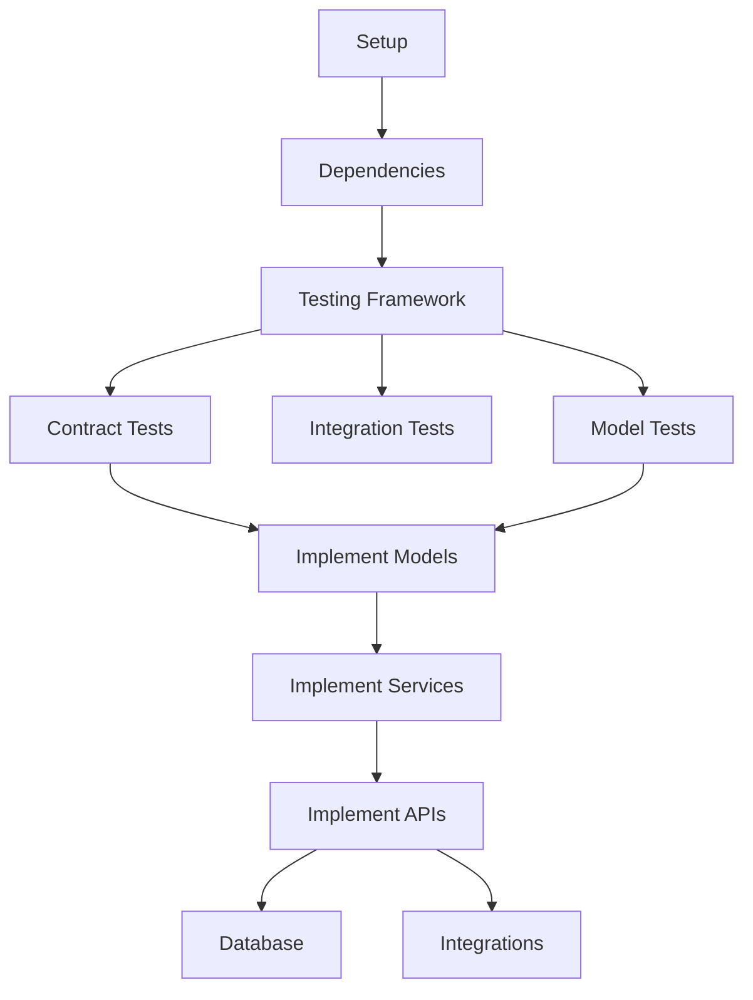

# Tasks: [FEATURE NAME] (SpecMap Enhanced)

**Feature ID**: [###-feature-name]
**Tasks Document ID**: [###-T]
**Generated**: [YYYY-MM-DD]
**Plan Source**: `02-planning/features/[###-feature-name]/plan.md`
**System**: SpecMap (Unified Spec-Kit + RULEMAP-PRD)

---

## Quick Reference

| Metric | Count |
|--------|-------|
| **Total Tasks** | [###] |
| **Completed** | [###] |
| **In Progress** | [###] |
| **Pending** | [###] |
| **Blocked** | [###] |
| **Estimated Duration** | [X weeks] |
| **Progress** | [XX%] |

---

## Execution Flow

```
INPUT: Implementation plan from /plan.md
  ↓
PARSE: Extract design documents, contracts, data models
  ↓
GENERATE: Phase-based task breakdown with IDs
  ↓
SEQUENCE: Order by dependencies (tests before implementation)
  ↓
MARK: Identify parallel execution opportunities [P]
  ↓
VALIDATE: 100% requirement coverage, all dependencies clear
  ↓
OUTPUT: Executable task list ready for implementation
```

---

## Prerequisites Validation

### Required Documents (Must Exist Before Tasks Generation)

- [ ] **Specification**: `01-specifications/features/[###-feature-name]/spec.md`
  - RULEMAP Score: [X.X/10] (Must be >= 8.0)
  - Status: Approved

- [ ] **Implementation Plan**: `02-planning/features/[###-feature-name]/plan.md`
  - All phases defined
  - All decisions made
  - Technical approach validated

- [ ] **Research Complete**: `02-planning/features/[###-feature-name]/research.md`
  - All questions resolved
  - All unknowns clarified
  - Technology choices confirmed

- [ ] **Data Model**: `02-planning/features/[###-feature-name]/data-model.md` *(if applicable)*
  - All entities defined
  - Relationships mapped

- [ ] **Contracts**: `02-planning/features/[###-feature-name]/contracts/` *(if applicable)*
  - All API endpoints specified
  - Request/response schemas defined

**Validation Result**: [✅ Ready / ⚠️ Missing Items / ❌ Blocked]

---

## Task Format

### Standard Task Entry

```yaml
[###-T-###]: [P?] [Task Description]
  type: "[Model/Service/API/Test/Documentation]"
  file: "[Exact file path]"
  implements: "[###-R-###]"        # Requirement it fulfills
  makes_pass: ["[###-T-###]"]      # Tests this will make pass
  depends_on: ["[###-T-###]"]      # Prerequisites
  blocks: ["[###-T-###]"]          # What depends on this
  parallel: [P or blank]           # [P] if can run parallel
  estimated: "[X hours/days]"
  status: "[Pending/In Progress/Blocked/Complete]"
```

### Parallel Execution Marker `[P]`

**Rules**:
- Tasks marked `[P]` can run simultaneously
- Only mark `[P]` if tasks modify DIFFERENT files
- Same file = sequential (no `[P]`)
- Tests before implementation (TDD) = sequential

**Example**:
```
✅ [P] OK: 001-T-010 (src/models/user.py) + [P] 001-T-011 (src/models/post.py)
❌ NO [P]: 001-T-070 (src/api/endpoints.py) + 001-T-071 (src/api/endpoints.py)
```

---

## Phase 0: Setup & Prerequisites (Pre-Implementation)

### Project Setup
**Purpose**: Initialize project structure and dependencies

#### [###-T-001]: Initialize project structure
- **Type**: Setup
- **File**: Project root
- **Command**: `[framework init command]`
- **Parallel**: N/A (Must be first)
- **Estimated**: 0.5 hours
- **Deliverable**: Project skeleton created

#### [###-T-002]: Install and configure dependencies
- **Type**: Setup
- **File**: `requirements.txt` / `package.json` / etc.
- **Dependencies**: Listed in plan.md
- **Depends on**: [###-T-001]
- **Estimated**: 1 hour
- **Deliverable**: All dependencies installed and working

#### [###-T-003]: Configure development tools
- **Type**: Setup
- **Files**: `.eslintrc`, `.prettierrc`, `pyproject.toml`, etc.
- **Parallel**: [P]
- **Depends on**: [###-T-002]
- **Estimated**: 1 hour
- **Includes**:
  - Linter configuration
  - Formatter setup
  - Pre-commit hooks
  - Type checking

#### [###-T-004]: Setup testing framework
- **Type**: Setup
- **Files**: `pytest.ini`, `jest.config.js`, etc.
- **Parallel**: [P]
- **Depends on**: [###-T-002]
- **Estimated**: 1 hour
- **Deliverable**: Test framework configured and running

**Phase 0 Exit Criteria**:
- [ ] Project structure created
- [ ] All dependencies installed
- [ ] Dev tools configured and passing
- [ ] Test framework ready

---

## Phase 1: Test-First Development (TDD Red Phase)

**CRITICAL**: All tests in this phase MUST be written BEFORE any implementation.
**Expected Result**: All tests FAIL (Red phase) - this is correct and required.

### Contract Tests (API Validation)

#### [###-T-020]: [P] Contract test POST /api/[resource]
- **Type**: Contract Test
- **File**: `tests/contract/test_[resource]_post.py`
- **Validates**: [###-A-001] (Acceptance criterion from spec)
- **Implements**: [###-R-010] (Requirement)
- **Must Fail**: Yes (TDD Red phase)
- **Parallel**: [P]
- **Depends on**: [###-T-004]
- **Estimated**: 2 hours
- **Test Checks**:
  - Request schema validation
  - Response schema validation
  - Status codes
  - Error responses

#### [###-T-021]: [P] Contract test GET /api/[resource]/{id}
- **Type**: Contract Test
- **File**: `tests/contract/test_[resource]_get.py`
- **Validates**: [###-A-002]
- **Must Fail**: Yes (TDD Red phase)
- **Parallel**: [P]
- **Depends on**: [###-T-004]
- **Estimated**: 2 hours

#### [###-T-022]: [P] Contract test PUT /api/[resource]/{id}
- **Type**: Contract Test
- **File**: `tests/contract/test_[resource]_put.py`
- **Validates**: [###-A-003]
- **Must Fail**: Yes (TDD Red phase)
- **Parallel**: [P]
- **Depends on**: [###-T-004]
- **Estimated**: 2 hours

#### [###-T-023]: [P] Contract test DELETE /api/[resource]/{id}
- **Type**: Contract Test
- **File**: `tests/contract/test_[resource]_delete.py`
- **Validates**: [###-A-004]
- **Must Fail**: Yes (TDD Red phase)
- **Parallel**: [P]
- **Depends on**: [###-T-004]
- **Estimated**: 1.5 hours

### Integration Tests (User Story Validation)

#### [###-T-030]: [P] Integration test for [User Story 1]
- **Type**: Integration Test
- **File**: `tests/integration/test_user_story_1.py`
- **Tests**: Complete user flow from spec
- **Validates**: [###-A-005], [###-A-006]
- **Must Fail**: Yes (TDD Red phase)
- **Parallel**: [P]
- **Depends on**: [###-T-004]
- **Estimated**: 3 hours
- **Scenarios**:
  - Happy path: [Describe expected flow]
  - Edge cases: [Describe edge scenarios]
  - Error cases: [Describe error handling]

#### [###-T-031]: [P] Integration test for [User Story 2]
- **Type**: Integration Test
- **File**: `tests/integration/test_user_story_2.py`
- **Tests**: [Another complete user flow]
- **Validates**: [###-A-007], [###-A-008]
- **Must Fail**: Yes (TDD Red phase)
- **Parallel**: [P]
- **Depends on**: [###-T-004]
- **Estimated**: 3 hours

### Model/Entity Tests

#### [###-T-040]: [P] Tests for [Entity1] model
- **Type**: Model Test
- **File**: `tests/models/test_[entity1].py`
- **Tests**: Entity creation, validation, relationships
- **Must Fail**: Yes (TDD Red phase)
- **Parallel**: [P]
- **Depends on**: [###-T-004]
- **Estimated**: 2 hours
- **Test Coverage**:
  - Valid entity creation
  - Field validation rules
  - Relationship integrity
  - Business rule enforcement

#### [###-T-041]: [P] Tests for [Entity2] model
- **Type**: Model Test
- **File**: `tests/models/test_[entity2].py`
- **Must Fail**: Yes (TDD Red phase)
- **Parallel**: [P]
- **Depends on**: [###-T-004]
- **Estimated**: 2 hours

**Phase 1 Exit Criteria**:
- [ ] All contract tests written and FAILING
- [ ] All integration tests written and FAILING
- [ ] All model tests written and FAILING
- [ ] Test suite runs successfully (with failures)
- [ ] 100% requirement coverage in tests
- [ ] Code review approved
- [ ] **Ready for TDD Green Phase (Implementation)**

---

## Phase 2: Implementation (TDD Green Phase)

**CRITICAL**: No implementation should exist before Phase 1 tests are failing.
**Goal**: Make all tests pass (Green phase).

### Data Models / Entities

#### [###-T-050]: [P] Implement [Entity1] model
- **Type**: Model Implementation
- **File**: `src/models/[entity1].py`
- **Implements**: [###-R-005]
- **Makes Pass**: [###-T-040] (Model test)
- **Depends on**: [###-T-040] (Test must exist and fail first)
- **Parallel**: [P]
- **Estimated**: 3 hours
- **Implementation Includes**:
  - Entity class definition
  - Field definitions with types
  - Validation methods
  - Relationship mappings
  - Business rule enforcement

#### [###-T-051]: [P] Implement [Entity2] model
- **Type**: Model Implementation
- **File**: `src/models/[entity2].py`
- **Implements**: [###-R-006]
- **Makes Pass**: [###-T-041]
- **Depends on**: [###-T-041]
- **Parallel**: [P]
- **Estimated**: 3 hours

#### [###-T-052]: Define entity relationships
- **Type**: Model Configuration
- **File**: `src/models/relationships.py` or in model files
- **Implements**: Data model from plan
- **Makes Pass**: Related model tests
- **Depends on**: [###-T-050], [###-T-051]
- **Estimated**: 2 hours

### Service Layer / Business Logic

#### [###-T-060]: [P] Implement [Service1] business logic
- **Type**: Service Implementation
- **File**: `src/services/[service1].py`
- **Implements**: [###-R-010]
- **Makes Pass**: [###-T-030] (Integration test)
- **Depends on**: [###-T-050], [###-T-040]
- **Parallel**: [P]
- **Estimated**: 4 hours
- **Implementation Includes**:
  - CRUD operations
  - Business rules
  - Data validation
  - Error handling

#### [###-T-061]: [P] Implement [Service2] business logic
- **Type**: Service Implementation
- **File**: `src/services/[service2].py`
- **Implements**: [###-R-011]
- **Makes Pass**: [###-T-031]
- **Depends on**: [###-T-051], [###-T-041]
- **Parallel**: [P]
- **Estimated**: 4 hours

#### [###-T-062]: Implement validation middleware
- **Type**: Middleware
- **File**: `src/middleware/validation.py`
- **Makes Pass**: Contract tests
- **Depends on**: [###-T-050], [###-T-051]
- **Estimated**: 3 hours
- **Validates**:
  - Request payload structure
  - Data type conformance
  - Business rule compliance

### API Layer / Controllers

#### [###-T-070]: Implement POST /api/[resource]
- **Type**: API Endpoint
- **File**: `src/api/[resource]_endpoints.py`
- **Implements**: [###-R-015]
- **Makes Pass**: [###-T-020] (Contract test)
- **Depends on**: [###-T-060], [###-T-062]
- **Estimated**: 3 hours
- **Implementation**:
  - Route handler
  - Request parsing
  - Service layer call
  - Response formatting
  - Error handling

#### [###-T-071]: Implement GET /api/[resource]/{id}
- **Type**: API Endpoint
- **File**: `src/api/[resource]_endpoints.py` (same file)
- **Makes Pass**: [###-T-021]
- **Depends on**: [###-T-070] (same file, sequential)
- **Estimated**: 2 hours

#### [###-T-072]: Implement PUT /api/[resource]/{id}
- **Type**: API Endpoint
- **File**: `src/api/[resource]_endpoints.py` (same file)
- **Makes Pass**: [###-T-022]
- **Depends on**: [###-T-071] (same file, sequential)
- **Estimated**: 2.5 hours

#### [###-T-073]: Implement DELETE /api/[resource]/{id}
- **Type**: API Endpoint
- **File**: `src/api/[resource]_endpoints.py` (same file)
- **Makes Pass**: [###-T-023]
- **Depends on**: [###-T-072] (same file, sequential)
- **Estimated**: 2 hours

### Error Handling & Logging

#### [###-T-080]: Implement error handling middleware
- **Type**: Middleware
- **File**: `src/middleware/error_handler.py`
- **Makes Pass**: Error test cases
- **Depends on**: [###-T-070]
- **Estimated**: 3 hours
- **Handles**:
  - Validation errors
  - Business logic errors
  - Database errors
  - Unexpected exceptions

#### [###-T-081]: [P] Implement logging infrastructure
- **Type**: Infrastructure
- **File**: `src/utils/logger.py`
- **Parallel**: [P]
- **Depends on**: [###-T-001]
- **Estimated**: 2 hours
- **Logs**:
  - Request/response info
  - Errors and exceptions
  - Business events
  - Performance metrics

**Phase 2 Exit Criteria**:
- [ ] All contract tests PASSING (Green phase achieved)
- [ ] All integration tests PASSING
- [ ] All model tests PASSING
- [ ] Code review completed
- [ ] No linting errors
- [ ] No type checking errors
- [ ] Constitution compliance verified

---

## Phase 3: Integration & Enhancement

### Database Integration

#### [###-T-090]: Create database migration scripts
- **Type**: Database
- **File**: `migrations/001_initial_schema.sql`
- **Implements**: Data model from plan
- **Depends on**: [###-T-050], [###-T-051]
- **Estimated**: 3 hours
- **Creates**:
  - Tables for all entities
  - Indexes
  - Constraints
  - Initial data (if needed)

#### [###-T-091]: Connect models to database
- **Type**: Database Integration
- **File**: Model files + `src/database/connection.py`
- **Depends on**: [###-T-090]
- **Estimated**: 2 hours
- **Configures**:
  - Database connection
  - ORM setup
  - Connection pooling
  - Transaction management

#### [###-T-092]: Add database indexes
- **Type**: Database Optimization
- **File**: `migrations/002_add_indexes.sql`
- **Purpose**: Performance optimization
- **Depends on**: [###-T-091]
- **Estimated**: 1.5 hours
- **Indexes for**:
  - Common queries
  - Foreign keys
  - Search fields

### External Integrations

#### [###-T-100]: Integrate with [External System 1]
- **Type**: External Integration
- **File**: `src/integrations/[external_system].py`
- **Implements**: [###-R-020]
- **Depends on**: [###-T-060]
- **Estimated**: 4 hours
- **Integration Includes**:
  - API client setup
  - Authentication handling
  - Error handling
  - Retry logic
  - Response parsing

#### [###-T-101]: Implement authentication middleware
- **Type**: Middleware
- **File**: `src/middleware/auth.py`
- **Implements**: [###-R-025]
- **Based on**: [###-D-003] (Auth decision)
- **Depends on**: [###-T-070]
- **Estimated**: 5 hours
- **Handles**:
  - Token validation
  - User authentication
  - Permission checking
  - Session management

### Performance Optimization

#### [###-T-110]: [P] Implement caching layer
- **Type**: Infrastructure
- **File**: `src/services/cache.py`
- **Implements**: [###-R-030] (Performance requirement)
- **Parallel**: [P]
- **Estimated**: 4 hours
- **Caching**:
  - Frequently accessed data
  - Expensive computations
  - External API responses

#### [###-T-111]: [P] Implement rate limiting
- **Type**: Middleware
- **File**: `src/middleware/rate_limit.py`
- **Purpose**: Security and stability
- **Parallel**: [P]
- **Estimated**: 3 hours

**Phase 3 Exit Criteria**:
- [ ] All external integrations working
- [ ] Database fully integrated and tested
- [ ] Performance optimizations implemented
- [ ] Security middleware active
- [ ] Integration tests all passing

---

## Phase 4: Testing & Quality Assurance

### Additional Test Coverage

#### [###-T-120]: [P] Unit tests for [Component 1]
- **Type**: Unit Test
- **File**: `tests/unit/test_[component1].py`
- **Coverage Target**: 90%+
- **Parallel**: [P]
- **Estimated**: 3 hours

#### [###-T-121]: [P] Unit tests for [Component 2]
- **Type**: Unit Test
- **File**: `tests/unit/test_[component2].py`
- **Coverage Target**: 90%+
- **Parallel**: [P]
- **Estimated**: 3 hours

### Performance Testing

#### [###-T-130]: Load testing
- **Type**: Performance Test
- **File**: `tests/performance/load_test.py`
- **Validates**: [###-R-040] (Performance spec)
- **Tool**: [Locust/JMeter/k6]
- **Estimated**: 4 hours
- **Tests**:
  - Response time under load
  - Throughput capacity
  - Resource utilization
  - Error rates

#### [###-T-131]: Stress testing
- **Type**: Performance Test
- **File**: `tests/performance/stress_test.py`
- **Tests**: System limits
- **Estimated**: 3 hours
- **Scenarios**:
  - Peak load handling
  - Graceful degradation
  - Recovery behavior

### Security Testing

#### [###-T-140]: Security audit
- **Type**: Security Test
- **Validation ID**: [###-V-003]
- **Tool**: [OWASP ZAP / Similar]
- **Estimated**: 5 hours
- **Checks**:
  - Authentication vulnerabilities
  - Authorization bypass
  - Injection attacks
  - XSS/CSRF
  - Data exposure

### Manual Validation

#### [###-T-150]: Execute quickstart validation scenarios
- **Type**: Manual Testing
- **Source**: `02-planning/features/[###-feature-name]/quickstart.md`
- **Validates**: All acceptance criteria
- **Estimated**: 4 hours
- **Scenarios from**: User stories in specification

**Phase 4 Exit Criteria**:
- [ ] Test coverage >= 80%
- [ ] All performance tests passing
- [ ] Security audit passed
- [ ] Manual validation complete
- [ ] All acceptance criteria verified

---

## Phase 5: Documentation & Deployment Prep

### Documentation

#### [###-T-160]: [P] Write user documentation
- **Type**: Documentation
- **File**: `06-documentation/user-guides/[feature].md`
- **Parallel**: [P]
- **Estimated**: 4 hours
- **Includes**:
  - Feature overview
  - Getting started guide
  - Usage examples
  - FAQ
  - Troubleshooting

#### [###-T-161]: [P] Write technical documentation
- **Type**: Documentation
- **File**: `06-documentation/technical-docs/[feature].md`
- **Parallel**: [P]
- **Estimated**: 3 hours
- **Includes**:
  - Architecture overview
  - API reference
  - Data model docs
  - Integration guides

#### [###-T-162]: [P] Update API documentation
- **Type**: Documentation
- **File**: `06-documentation/api-specifications/[feature].yaml`
- **Parallel**: [P]
- **Estimated**: 2 hours
- **Format**: OpenAPI 3.0 specification

### Deployment Preparation

#### [###-T-170]: Create deployment checklist
- **Type**: Documentation
- **File**: `08-deliverables/deployment-checklist.md`
- **Estimated**: 2 hours
- **Checklist Items**:
  - Pre-deployment verification
  - Deployment steps
  - Post-deployment validation
  - Rollback procedures

#### [###-T-171]: Setup monitoring and alerts
- **Type**: Infrastructure
- **Files**: Monitoring configuration
- **Estimated**: 3 hours
- **Monitors**:
  - Application health
  - Error rates
  - Performance metrics
  - Resource utilization

#### [###-T-172]: Create rollback procedures
- **Type**: Documentation
- **File**: `08-deliverables/rollback-procedures.md`
- **Estimated**: 2 hours

**Phase 5 Exit Criteria**:
- [ ] All documentation complete and reviewed
- [ ] Deployment checklist validated
- [ ] Monitoring configured
- [ ] Rollback procedures tested
- [ ] Stakeholder approval obtained

---

## Task Summary Statistics

### By Phase

| Phase | Total | Complete | In Progress | Pending | Blocked |
|-------|-------|----------|-------------|---------|---------|
| **Phase 0: Setup** | [##] | [##] | [##] | [##] | [##] |
| **Phase 1: TDD Red** | [##] | [##] | [##] | [##] | [##] |
| **Phase 2: TDD Green** | [##] | [##] | [##] | [##] | [##] |
| **Phase 3: Integration** | [##] | [##] | [##] | [##] | [##] |
| **Phase 4: QA** | [##] | [##] | [##] | [##] | [##] |
| **Phase 5: Docs & Deploy** | [##] | [##] | [##] | [##] | [##] |
| **TOTAL** | [##] | [##] | [##] | [##] | [##] |

### By Type

| Type | Count | Progress |
|------|-------|----------|
| Setup | [##] | [XX%] |
| Test (Contract) | [##] | [XX%] |
| Test (Integration) | [##] | [XX%] |
| Test (Unit) | [##] | [XX%] |
| Model | [##] | [XX%] |
| Service | [##] | [XX%] |
| API Endpoint | [##] | [XX%] |
| Middleware | [##] | [XX%] |
| Integration | [##] | [XX%] |
| Documentation | [##] | [XX%] |
| Infrastructure | [##] | [XX%] |

### Parallel Execution Groups

**Maximum Parallelism**: [##] tasks can run simultaneously

**Parallel Groups**:
- **Group 1** (Phase 1): [###-T-020], [###-T-021], [###-T-022], [###-T-023] (Contract tests)
- **Group 2** (Phase 1): [###-T-030], [###-T-031] (Integration tests)
- **Group 3** (Phase 1): [###-T-040], [###-T-041] (Model tests)
- **Group 4** (Phase 2): [###-T-050], [###-T-051] (Model implementations)
- **Group 5** (Phase 2): [###-T-060], [###-T-061] (Service implementations)
- **Group 6** (Phase 5): [###-T-160], [###-T-161], [###-T-162] (Documentation)

---

## Dependencies Graph

### Critical Path

```
[###-T-001] → [###-T-002] → [###-T-004] → [###-T-020] → [###-T-050] → [###-T-060] → [###-T-070] → [###-M-003]
```

**Critical Path Duration**: [X weeks/days]

### Dependency Chains



---

## Requirement Coverage Matrix

### Requirements → Tasks Mapping

| Requirement | Implemented By | Tested By | Status |
|-------------|----------------|-----------|--------|
| [###-R-001] | [###-T-050] | [###-T-040], [###-T-020] | ✅ |
| [###-R-002] | [###-T-051] | [###-T-041], [###-T-021] | 🔄 |
| [###-R-003] | [###-T-060] | [###-T-030] | 📋 |
| [###-R-004] | [###-T-061] | [###-T-031] | 📋 |

**Coverage**: [100%] - All requirements mapped to tasks

---

## Timeline & Milestones

### Project Schedule

```
Week 1: Setup + TDD Red Phase
├── Days 1-2: Project setup ([###-T-001] to [###-T-004])
├── Days 3-4: Contract tests ([###-T-020] to [###-T-023])
└── Day 5: Integration + Model tests ([###-T-030], [###-T-040], [###-T-041])

Week 2: TDD Green Phase (Implementation)
├── Days 1-2: Models ([###-T-050] to [###-T-052])
├── Days 3-4: Services ([###-T-060] to [###-T-062])
└── Day 5: APIs ([###-T-070] to [###-T-073])

Week 3: Integration & Enhancement
├── Days 1-2: Error handling + Logging ([###-T-080], [###-T-081])
├── Days 3-4: Database + External integrations ([###-T-090], [###-T-100])
└── Day 5: Performance optimizations ([###-T-110], [###-T-111])

Week 4: QA & Documentation
├── Days 1-2: Additional tests ([###-T-120], [###-T-130])
├── Days 3-4: Documentation ([###-T-160], [###-T-161])
└── Day 5: Deployment prep ([###-T-170], [###-T-171])
```

### Milestone Targets

- **[###-M-001]**: Setup Complete - [DATE]
- **[###-M-002]**: TDD Red Phase Complete - [DATE]
- **[###-M-003]**: TDD Green Phase Complete - [DATE]
- **[###-M-004]**: Integration Complete - [DATE]
- **[###-M-005]**: Production Ready - [DATE]

---

## Risk & Blockers

### Known Risks

| Risk ID | Description | Impact | Mitigation | Owner |
|---------|-------------|--------|------------|-------|
| [###-I-001] | [Risk description] | High | [Mitigation plan] | [Person] |
| [###-I-002] | [Risk description] | Medium | [Mitigation plan] | [Person] |

### Current Blockers

| Task ID | Blocked By | Since | Estimated Delay |
|---------|------------|-------|-----------------|
| [###-T-###] | [###-I-001] | [DATE] | [X days] |
| [###-T-###] | [###-Q-007] | [DATE] | [X days] |

---

## Progress Tracking

### Daily Updates Log

**[YYYY-MM-DD]**
- Completed: [###-T-###], [###-T-###]
- In Progress: [###-T-###]
- Started: [###-T-###]
- Blocked: [###-T-###] by [###-I-###]

**[YYYY-MM-DD]**
- Completed: [###-T-###]
- In Progress: [###-T-###], [###-T-###]
- Unblocked: [###-T-###] (resolved [###-I-###])

### Velocity Metrics

- **Average completion rate**: [X] tasks/day
- **Estimated completion**: [DATE]
- **Ahead/Behind schedule**: [+/- X days]

---

## Constitution Compliance Check

### TDD Compliance (Article III)
- [ ] All tests written before implementation
- [ ] Tests failed initially (Red phase)
- [ ] Implementation made tests pass (Green phase)
- [ ] Refactoring performed while maintaining tests

### Simplicity Check (Article II)
- [ ] Minimal project structure used
- [ ] No unnecessary abstraction layers
- [ ] Complexity justified in plan.md

### Documentation Check (Article IV)
- [ ] API documentation complete
- [ ] Technical documentation up to date
- [ ] User guides written
- [ ] Code comments adequate

---

## Agent Handoff Information

### FROM: Task Planning Agent
**Delivered**:
- Complete task breakdown ([###-T-001] to [###-T-###])
- All dependencies identified
- Timeline established
- Parallel execution identified

### TO: Development Guide Agent
**Ready to begin**:
- Phase 0: Setup tasks
- Clear path to Phase 1 (TDD Red)
- All requirements mapped to tasks

**Agent Role**: Guide team through task execution, provide implementation support, conduct code reviews, update task status

---

## Status

**Tasks Document Status**: [Draft/Review/Approved/Active]
**Total Tasks**: [###]
**Estimated Duration**: [X weeks]
**Next Phase**: Implementation (Phase 2)
**Ready for Execution**: [Yes/No]

---

**SpecMap Enhanced Tasks Template** - Comprehensive, executable task breakdown with TDD workflow and tracking integration